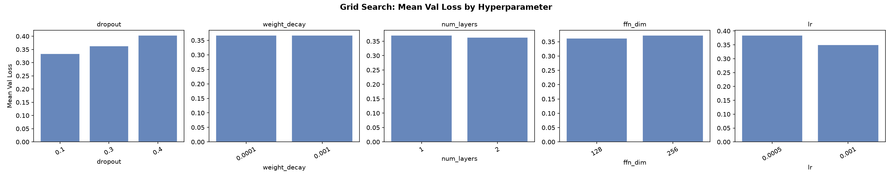
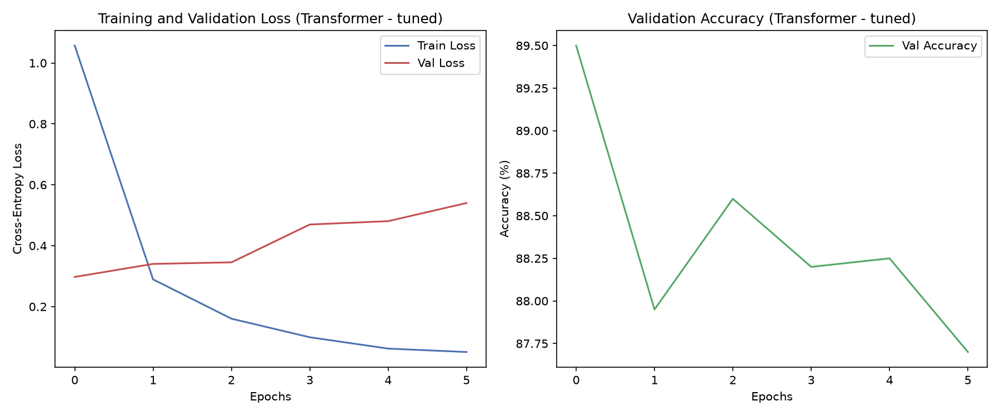
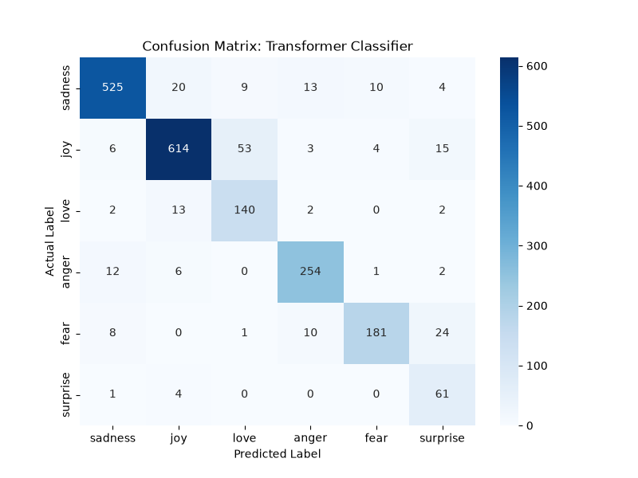
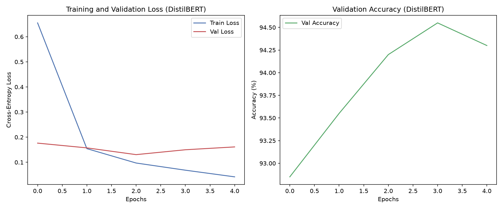

# Emotion Classification

A NLP project that classifies short texts into six emotions: **sadness, joy, love, anger, fear,** and **surprise**.

## Collaboration

Developed collaboratively with one groupmate during an overseas exchange programme.

## Overview

The project compares three approaches to emotion classification:

- A baseline multilayer perceptron (MLP)
- A custom Transformer classifier
- A fine-tuned DistilBERT model

The workflow covers text tokenisation, vocabulary construction, sequence padding, class-imbalance handling, model training, hyperparameter tuning, and error analysis.

The original [project report](docs/project_report.pdf) documents the methodology, experiments, and evaluation.

## Results

| Model | Test accuracy | Macro F1 |
|---|---:|---:|
| MLP baseline | 75.20% | 0.7154 |
| Tuned custom Transformer | 88.55% | 0.8429 |
| Fine-tuned DistilBERT | 93.05% | 0.8831 |

> **Note:** These figures are taken from the submitted project report. The notebook reproduces the same workflow locally, though exact metrics may vary slightly across runs, package versions, and hardware.

## Key techniques

- Custom tokenisation, vocabulary creation, and padded input sequences
- Class-weighted loss to account for imbalanced emotion labels
- Multi-head self-attention in the custom Transformer classifier
- Hyperparameter search across 48 Transformer configurations
- Fine-tuning of `distilbert-base-uncased`
- Confusion-matrix analysis and review of misclassified examples

## Selected outputs

### Transformer hyperparameter search



### Tuned Transformer performance





### DistilBERT fine-tuning



## Repository structure

```text
emotion_classification.ipynb   # Main notebook
outputs/                       # Selected charts and visualisations
docs/project_report.pdf        # Project report
requirements.txt               # Python dependencies
```

## Dataset

The notebook loads the [dair-ai/emotion](https://huggingface.co/datasets/dair-ai/emotion) dataset through Hugging Face Datasets.